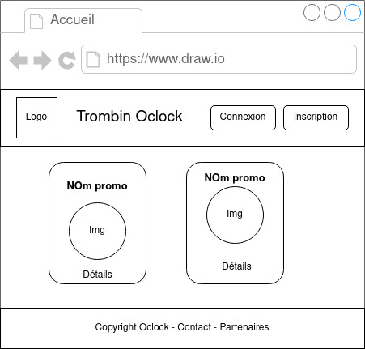

### Ajouter un étudiant
Sur la page d'accueil, un nouveau bouton a fait son apparition : "Ajouter un étudiant".
C'est un lien vers un formulaire !
#### Étape 1 : Remplir le select
Inspire toi de ce qui a été fait dans les autres controllers pour modifier la méthode `adminController.addStudent`.
<details>
<summary>Un coup de main ?</summary>
- Commence par require `dataMapper` dans le controller.
- Il faut ensuite appeller `dataMapper.getAllPromo`, en définissant le callback !
- Dans ce callback, n'oublie pas le traitement de l'erreur éventuelle, puis passe la liste des promotions à la view `admin/addStudent`.
- Dans la view `admin/addStudent`, utilise la liste des promos pour créer des `<option>`
</details>
#### Étape 2 : Traiter le POST
Utilise tout ce que tu connais pour traiter les informations du formulaire et ajouter un étudiant dans la base de données !
Remarque : on a déjà préparé la requete SQL ! cf [docs/sql.md](./doc/SQL.md)
<details>
<summary>Un peu d'aide ?</summary>
- Il faut d'abord ajouter le middleware `express.urlencoded({extended: true})` à `app` dans `index.js`.
- Ensuite, il faut définir une route POST qui va déclencher la méthode `adminController.addStudent`.
- Il faut maintenant coder la méthode `adminController.addStudent` !
  - Ajoute une nouvelle méthode `addStudent(studentInfo, callback)` dans le `dataMapper`. Cette méthode doit lancer une requête "INSERT ..." en utilisant les paramètres passés dans l'objet `studentInfo`. Inspire toi de ce qui a été fait précédement !
  - Dans `adminController.addStudent`, il faut maintenant appeller `dataMapper.addStudent` en lui passant les bons paramètres, et bien sur, en définissant un callback !
  - Dans ce callback, si tout s'est bien passé, redirige l'utilisateur vers la page de détails de la promotion sélectionnée.
</details>
### Bonus DIFFICILE : Pagination !
La liste exhaustive des étudiants est lente à charger, et compliquée à lire !
A toi de mettre en place une pagination dans cette page !!
Voici ce dont tu va avoir besoin:
- Une nouvelle requete SQL dans `dataMapper`, utilisant les mots-clefs "LIMIT" et "OFFSET". (Inspire toi de [cette doc](https://sql.sh/cours/limit)).
- Des paramètres GET. L'url ressemblera à ça : `/students?nbByPage=25&page=3`
- Un peu d'imagination !
<details>
<summary>De l'aide ?</summary>
Non non, c'est un bonus, donc tu te débrouille ! :smiling_imp:
</details>

***

# Trombin-o-clock

## CDC

### expression du besoin
Mail client : 
```
Bonjour, nous sommes une école qu'elle est bien, et nous voulons un outil pour faciliter les contacts entre étudiants.
Nous aimerions donc pouvoir lister les promotions ainsi que les étudiants qui les composent, 
mais aussi accèder aux détails d'un étudiant, photo de profil comprise.
L'accès aux profils serait libre et gratuit.
Dans un second temps l'outil pourrait servir à éditer les profils et promotions.

En ésperant que vous pourrez répondre favorablement à notre demande, 
Cordialement
Nicole.
```

### user stories

id|en tant que|je veux|afin de|sprint|
--|-----------|-------|-------|-------
9|visiteur|accéder à la page d'accueil|*|1
1|visiteur|accéder à la liste des promos|*|1
2|visiteur|accéder à la liste des étudiants d'une promo|*|1
3|visiteur|accéder aux détails d'un étudiant|pouvoir voir sa photo de profil et ses informations|1
4|utilisateur|éditer profil|*|2
5|admin|éditer profil utilisateurs|*|2
6|admin|éditer les promos|*|2
7|admin|créer les utilisateurs|*|2
8|admin|créer les promotions|*|2

### wireframes

Accueil :  
  
Promos :  

